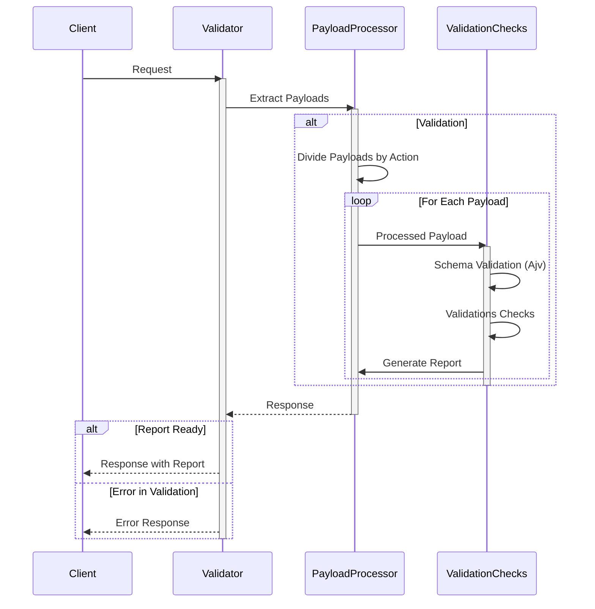

# ONDC-LOG-UTILITY (FIS)

This utility is designed to enable ONDC Network Participants to validate different flows of a financial service on ONDC.

ONDC FIS specification is an adaptation of [beckn financial specifications](https://github.com/beckn/financial-services).

These specifications will be released in multiple phases enabling different use cases and enhancements.

ONDC Financial Services developer guide [link](https://ondc-official.github.io/ONDC-FIS-Specifications)

## Latest Version

## Earlier Versions

| Version | Release Date | beckn Version | Comments |
| ------- | ------------ | ------------- | -------- |
| v1.0.0  | TBD          |               |          |

## Introduction

Open Network for Digital Commerce (ONDC) is a network based on beckn open protocol and will enable local commerce across segments, such as financial services, mobility, retail, etc., to be discovered and engaged by any network-enabled application.

ONDC's Validation Utility fuels a nationwide multi-modal network, ensuring seamless service consumption.

## Overview

This document provides an architectural overview of the utility designed to validate and process order status data. The utility operates within a larger system, handling FIS (Financial Integration Service) API sequences.

## Enabled/Supported use cases on network

- `Personal loan`
- `Invoice based loan`
- `Prepayment Personal loan`
- `Prepayment Invoice based loan`

## Modules

### 1. `Constants` Module

#### Purpose
- Stores predefined constants used across the utility.

#### Key Constants
- `FisApiSequence`: Enumerates different FIS API sequences.
- `formHeadingsFis`: Represents Form headings based on action & flow
- Other specific constants for API sequences.

### 2. `Logger` Module

#### Purpose
- Provides logging capabilities for the utility.

#### Logging Types
- Informational messages.
- Error messages.
- Comparison logs during validation.

### 3. `DAO` Module

#### Purpose
- Handles data access operations for storing and retrieving values.

#### Key Functions
- `getValue`: Retrieves stored values.
- `setValue`: Stores values.

### 4. `Shared` Module

#### Purpose
- Contains shared utility functions used across the utility.

#### Key Utility Functions
- `validateSchema`: Validates data against predefined schemas.
- `checkFISContext`: Validates FIS context.
- `timeDifference`: Calculates the time difference.
- `checkBppIdOrBapId`: Validates BPP or BAP ID.
- `isValidUrl`: Checks the validity of a URL.
 

## Validation Checks

#### Key Functionalities
- JSON validation and presence checks.
- Schema validation using predefined schemas.
- Context validation and checks for BAP/BPP IDs.
- Data comparisons for consistency.
- Transaction ID and Message ID comparisons.
- Item validation with valid ID.
- Payments validation with tags.
- Quote breakup comparison against requested value.
- X-Input validation with valid URL's
- Cancellation terms and document validation.

## Sequence Diagram

## Workflow

1. **Data Ingestion**
   - Payloads are broken & ingested into their respective  validation `function`.

2. **Validation Process**
   - Every `function` performs a series of validations, including schema validation, context & message checks, and data comparisons.

3. **Logging**
   - The `Logger` module logs informational messages, errors, and detailed comparisons during the validation process.

4. **Data Storage**
   - The `DAO` module handles the storage and retrieval of values required for comparisons.

5. **Results**
   - The function returns an object summarizing the validation results, indicating any discrepancies or issues found in any of the API calls.